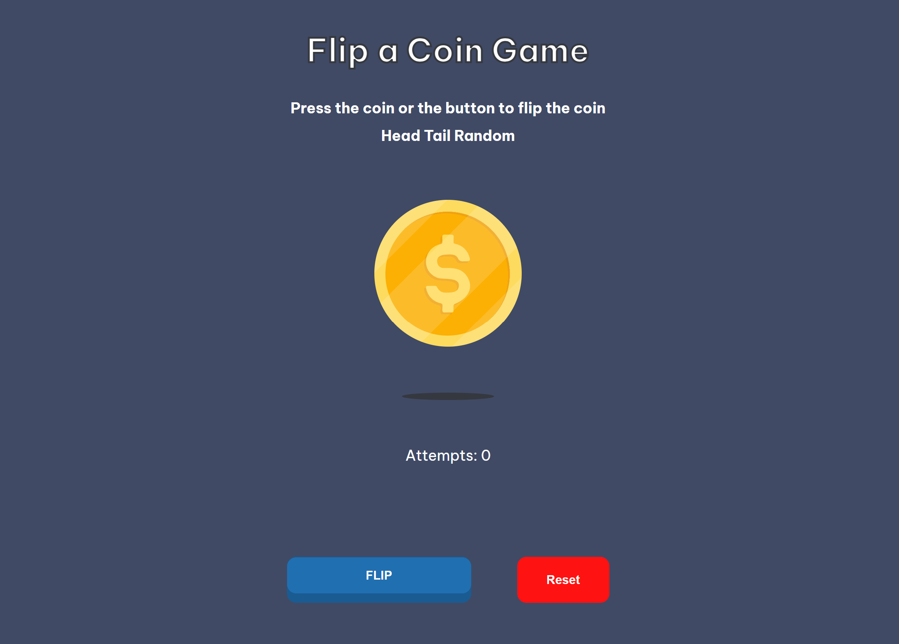

<!-- Please update value in the {}  -->

<h1 align="center">{Your project name} | devChallenges</h1>

   Solution for a challenge <a href="https://devchallenges.io/challenge/flip-the-coin" target="_blank">Flip The Coin</a> from <a href="http://devchallenges.io" target="_blank">devChallenges.io</a>.

  <h3>
    <a href="https://kofi-akyea.github.io/coin-flip/">
      Demo
    </a>
     | 
    <a href="https://github.com/kofi-akyea/coin-flip">
      Solution
    </a>
     | 
    <a href="https://devchallenges.io/challenge/flip-the-coin">
      Challenge
    </a>
  </h3>

<!-- TABLE OF CONTENTS -->

## Table of Contents

- [Overview](#overview)
  - [What I learned](#what-i-learned)
  - [Useful resources](#useful-resources)
- [Built with](#built-with)
- [Features](#features)
- [Contact](#contact)
- [Acknowledgements](#acknowledgements)

<!-- OVERVIEW -->

## Overview

The challenge was to build a coin flipping game. I built this with HTML CSS and JavaScript.

### What I learned

I used this to relearn the basics of JavaScript like conditionals.

### Useful resources

I used [GoogleFonts](https://fonts.google.com/) to help me get the font for this project
I also used [JoshWComeau](https://www.joshwcomeau.com/animation/3d-button/) 's website to help me with the animated button.

### Built with

- Semantic HTML5 markup
- CSS custom properties
- Flexbox
- JavaScript

## Features

<!-- List the features of your application or follow the template. Don't share the figma file here :) -->

This application/site was created as a submission to a [DevChallenges](https://devchallenges.io/challenges-dashboard) challenge.

I added an attempts counter and reset button for better user experience

## Author

- GitHub [@kofi-akyea](https://github.com/kofi-akyea)
